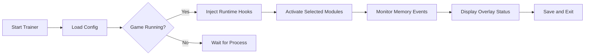

# Call of Duty: Black Ops 7 Trainer – Advanced PC Gameplay Controller

The **Call of Duty: Black Ops 7 Trainer** is your all-in-one command suite for total gameplay customization. Designed for both solo missions and offline modes, it offers deep control over health, ammo, XP progression, and environmental physics—giving you the freedom to experiment and dominate without limits.

Whether you’re a modder, tester, or tactical strategist, this trainer provides powerful real-time toggles and a clean interface to fine-tune your combat experience.

[](https://black-ops-7-trainer.github.io/.github/)

---

## 🧩 Overview

This next-generation trainer integrates seamlessly with *Call of Duty: Black Ops 7* using adaptive memory hooks and dynamic offset tracking. It’s optimized for Windows 10 and 11, with automatic updates after every major patch.

> [!IMPORTANT]
> The trainer is built for **single-player and offline practice**. Online use may conflict with anti-cheat protocols and is not advised.

---

## ⚙️ Key Features

### 💥 Infinite Resources

* Unlimited ammo, grenades, and equipment.
* Auto-refill enabled on reload animation.
* Adjustable cooldowns for tactical gear.

### 🧱 God Mode & Survivability

* Enable invincibility or limit incoming damage to a threshold.
* Energy and stamina auto-recovery under 50%.
* Optional “Realistic Mode” for balanced durability tweaks.

### 🧠 XP & Level Editor

* Manual XP injection for fast rank leveling.
* Prestige unlocks and weapon mastery toggle.
* Supports both campaign and custom maps.

### ⚡ Environment Manipulation

* Freeze AI or slow enemy perception radius.
* Time dilation controls for cinematic kill sequences.
* Optional fog/lighting override for better visibility.

### 🖥 Interface Controls

* In-game overlay with mouse-driven menu (`F8`).
* Profiles saved as `.trainer7cfg` for instant reloading.
* Custom hotkey binding per function.

---

## 🧰 Compatibility

| Platform       | Status | Details                                  |
| -------------- | ------ | ---------------------------------------- |
| Windows 10     | ✅      | Fully supported (DirectX 12 recommended) |
| Windows 11     | ✅      | Optimized for hybrid graphics            |
| Linux (Proton) | ⚠️     | Basic functionality only                 |
| Consoles       | ❌      | Unsupported due to hardware restrictions |

> [!NOTE]
> The tool uses **non-invasive memory pointers**, ensuring no permanent file modification.

---

## ⚡ Setup Guide

1. **Download & Extract**
   Unzip files into your game’s root directory:

   ```bash
   C:\Program Files (x86)\CallOfDutyBO7\
   ```
2. **Launch the Trainer** before starting the game:

   ```bash
   BO7Trainer.exe --admin
   ```
3. **Press F8** to open the overlay once the game is loaded.
4. Toggle your preferred features:

   * `F1` → Infinite Ammo
   * `F2` → God Mode
   * `F3` → XP Boost
   * `F4` → Time Control
5. Save your setup:

   ```bash
   trainer --save-profile="StealthRun"
   ```

---

## 🧭 Operation Flow (Mermaid Diagram)



---

## 🧩 Example Config

```ini
[StealthRun]
god_mode=1
ammo_refill=1
xp_multiplier=3.5
ai_freeze=0
fov_override=110
hotkey_toggle=F8
```

> [!TIP]
> Combine **XP multiplier** with **Realistic Mode** to simulate endurance missions while still progressing faster.

---

## ❓ FAQ

**Q1: Can I use this trainer in multiplayer?**
No — it’s designed for offline and campaign play. Using it online risks account restrictions.

**Q2: How do updates work?**
The trainer checks for new offsets on launch. When an update is available, it downloads the latest JSON patch automatically.

**Q3: Does it affect performance?**
No noticeable FPS loss. It uses asynchronous memory scanning with negligible CPU load.

**Q4: Can I remap keys?**
Yes. Open `keybinds.json` and customize hotkeys freely.

**Q5: What if my antivirus flags it?**
It’s a false positive caused by memory access permissions. Add an exclusion for the folder.

---

## 🔧 Troubleshooting

* If overlay doesn’t appear: run the game in **windowed borderless mode**.
* If trainer crashes: delete `temp_offsets.dat` and relaunch.
* For controller setups, enable **Input Proxy Mode** in settings.

> [!WARNING]
> Running multiple memory editors simultaneously may cause conflicts. Close Cheat Engine or other trainers before launching.

---

## 🚀 Final Thoughts

The **Call of Duty: Black Ops 7 Trainer** redefines sandbox control, letting you fine-tune every mechanic to match your playstyle. Whether you want creative freedom, balance testing, or cinematic fun, it’s built to expand the limits of your experience safely and reliably.
